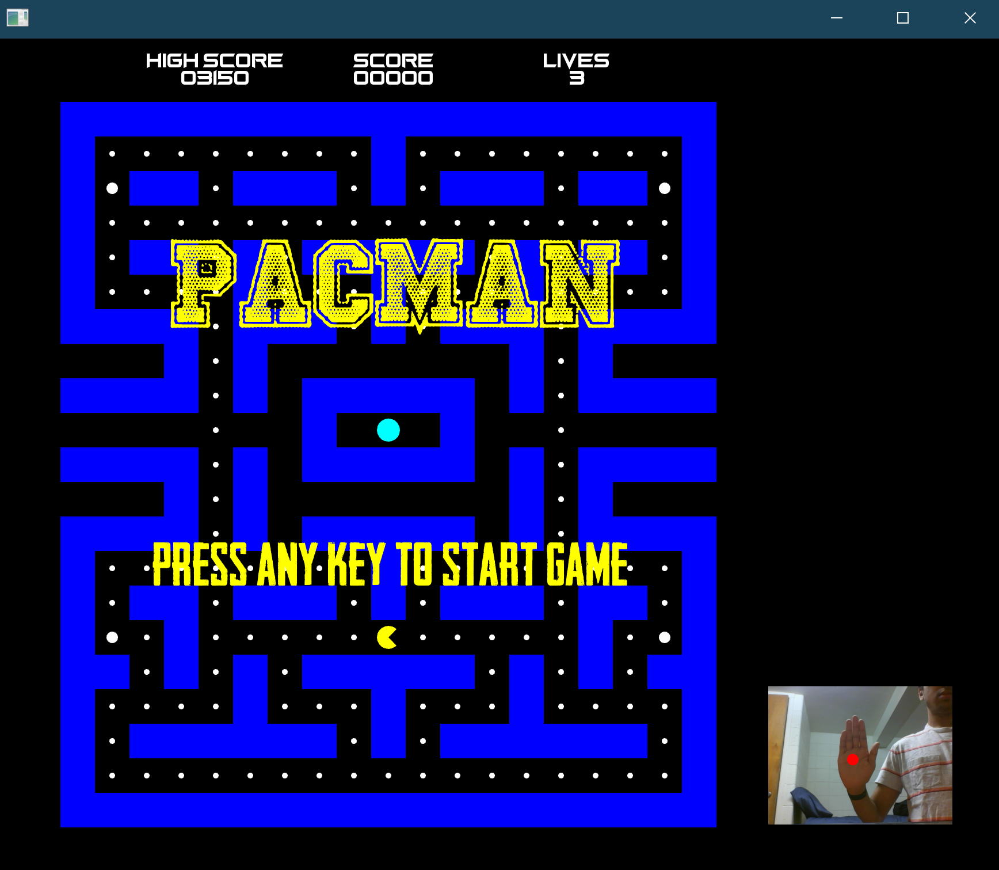
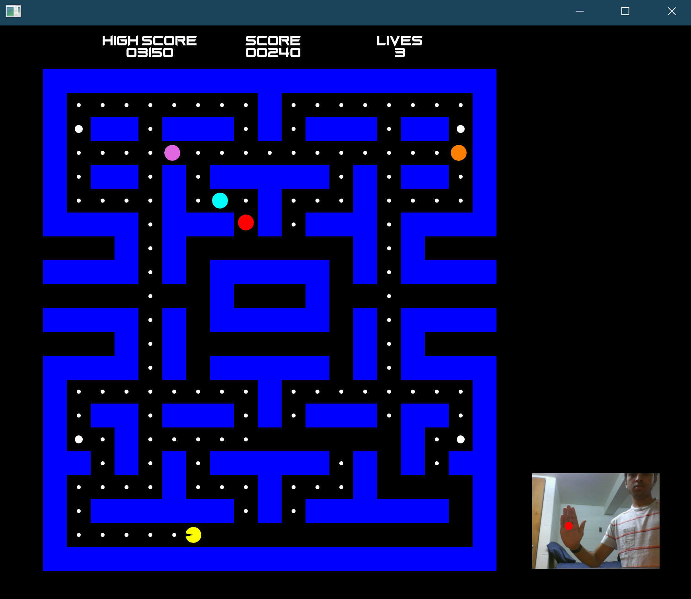
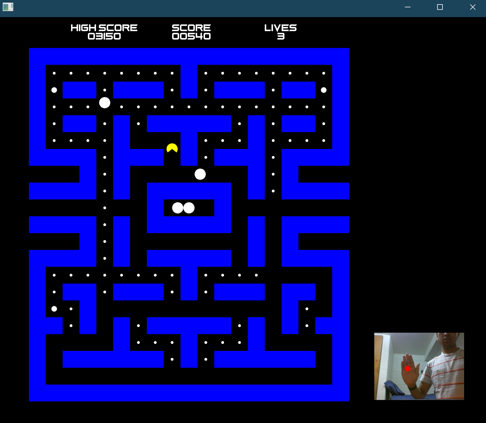
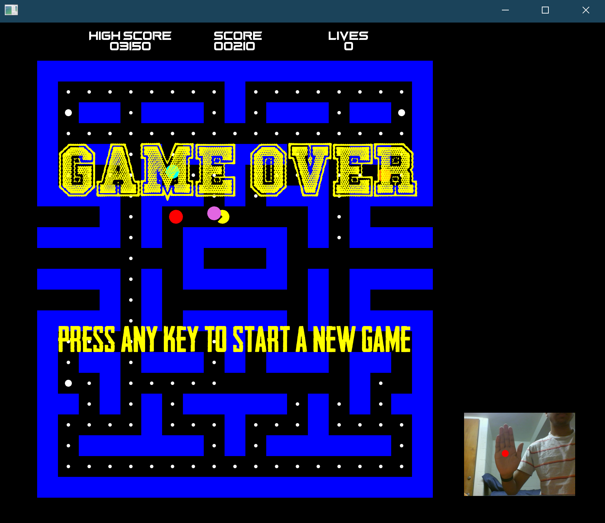

# PacMan

- This project is an interpretation of Pac-Man where the input to control the direction of the player comes from tracking the user's hand using color tracking to determine if the player should move up/down/left/right.

 | 
------------------------|------------------------
 | 
 |                        

## Dependencies

- [MSVC 2015+](https://visualstudio.microsoft.com/)
- [ofxOpenCV](https://openframeworks.cc/documentation/ofxOpenCv/)
- [openframeworks](https://openframeworks.cc/download/)

### Windows

#### Visual Studio
- [Visual Studio 2017](https://visualstudio.microsoft.com/)

## Quick Start

### Windows

- navigate to `fantastic-finale-Rishabhja101\fantastic-finale-Rishabhja101\` inside of this folder, find and open `fantastic-finale-Rishabhja101.sln` in Visual Studio 2017
- Build and run the solution to play the game

## Controls

On the bottom left portion of the window, there is a display of what is seen through the webcam.
A red dot is drawn to represent the position of the color being tracked. When you click on the image, the color that is clicked becomes the new color being tracked. Use this to calibrate the game to track your hand. For best results, try wearing a glove that is of a different color than the background so it is easier to track.

Once you begin the game, the webcam will be used to track your hand to determine how to move the player.

| Position of hand     | Action     |
|----------------------|------------|
| top of screen        | Move up    |
| bottom of screen     | Move down  |
| left side of screen  | Move left  |
| right side of screen | Move right |

## How the game works

- The rules are very similar to those of Pac-Man
- The player is the yellow character that you can control with your hand positions
- The ghosts are the 4 colored circles that move about the map. If the player collides with a ghost, they lose a life
- Once the player runs out of lives, the game is over
- The player can enter powerup mode by collecting a powerup. While in powerup mode, they ghosts turn blue and are no longer a threat to the player. Instead, the ghosts will now die and respawn when they come in contact with the player. However, the powerup mode only lasts a limited amount of time. They ghosts will begin to blink between blue and white when powerup mode is about to end
- The player's score increases every time they collect a coin, powerup, or eat a ghost while in powerup mode
- Once the player has collected all the coins and powerups on the map, the map resets, giving the player the opportunity to get an even higher score. The game only ends once the player loses all of their lives
